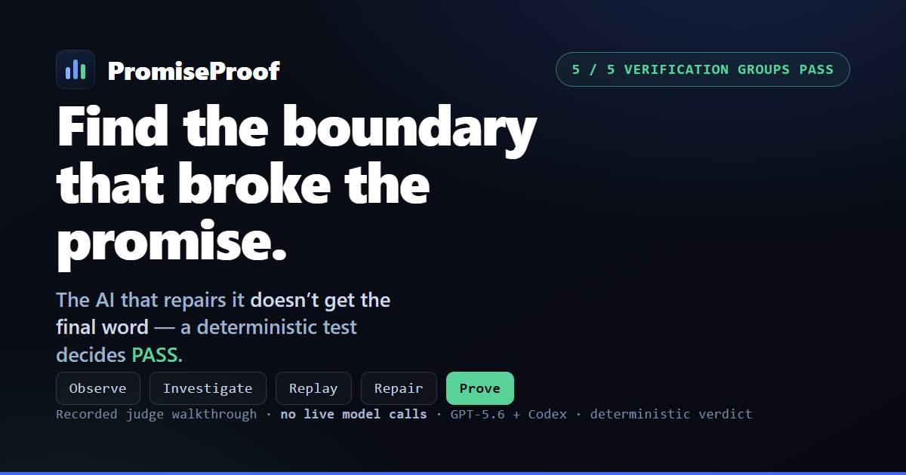
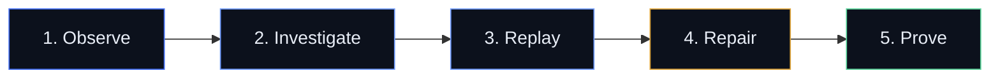

<div align="center">

# 🛡️ PromiseProof

### When software breaks a promise, the AI that repairs it doesn't get the final word.

Carry a broken product promise all the way through bounded diagnosis, constrained repair, and independent verification, where a deterministic test, *never a model*, decides PASS.

[](https://openai.com)
[](LICENSE)
[](https://www.typescriptlang.org/)
[](https://playwright.dev/)
[](https://workers.cloudflare.com/)

**[▶ Live demo](https://promiseproof.alex0paiva0.workers.dev/)** · **[Judge walkthrough](https://promiseproof.alex0paiva0.workers.dev/walkthrough/)** · [How it works](#how-it-works) · [Quick start](#quick-start-the-judge-path)



</div>

---

## The problem

A user turns personalization **off**. The UI says off. Browser storage says off. The backend says off. And yet one *identifiable* request still crosses the boundary to the recommendation service.

Monitoring can show that a promise broke. PromiseProof carries that evidence through bounded diagnosis, constrained repair, and independent verification, and it never lets the one thing that might be wrong, a model, declare itself correct.

It turns an "off means off" promise into an executable check, helps locate the implementation boundary that broke it, lets AI investigate and propose a repair, then hands the verdict to an unchanged deterministic test.

### Who it is for

PromiseProof is for product, QA, privacy, reliability, and platform engineers responsible for user-facing controls that cross browser, storage, network, and backend boundaries. It turns an ambiguous report like "OFF did not behave like OFF" into reproducible evidence and a bounded diagnostic action, so a team finds the responsible subsystem sooner.

## What makes it different

> **A model may investigate and repair. Deterministic evidence keeps the verdict.**

The final investigation schema has **no verdict field**. GPT-5.6 proposes and ranks candidate causes and requests one *allowlisted* diagnostic replay; Codex proposes a constrained two-file repair in a disposable worktree; a human approves the exact patch by its fingerprint. Then an **unchanged Playwright journey and deterministic evaluator**, the very ones that caught the break, decide PASS or FAIL.

The AI never grades its own work. That is the whole point.

## See it live

- 🌐 **[promiseproof.alex0paiva0.workers.dev](https://promiseproof.alex0paiva0.workers.dev/)** hosts the landing page at `/` and the interactive judge walkthrough at `/walkthrough/`.
- The walkthrough is a **recorded run** of one concrete synthetic failure and its approved repair, with no live model calls. It is reproducible without an API key once dependencies are installed.

## How it works



Authority stays with deterministic code and the human at every step: the model investigates read-only and never returns a verdict, the human approves the exact patch, and the unchanged evaluator alone decides PASS.

1. **Observe.** [Signal Shelf](#the-two-seeded-defects), a synthetic app, has personalization OFF everywhere the user can see. Playwright captures the journey and the real network traffic. One identifiable request crosses the service boundary while OFF, producing `PP_IDENTIFIABLE_EVENT_LEAK`. Broken promise.
2. **Investigate.** GPT-5.6 reads a sanitized, versioned dossier, **proposes and ranks** two-to-four candidate causes, and requests **one replay from a fixed allowlist**. Read-only. It never sees which fixture is seeded, and its final schema cannot carry a verdict.
3. **Replay.** Deterministic code executes the chosen probe (`inspect_startup_order`) and records the facts: collection started *before* the saved preference finished hydrating.
4. **Repair.** Codex (pinned SDK, one turn) proposes a constrained **two-file** patch plus a focused regression test in a **disposable git worktree**. A human reviews the exact diff and types the digest-bound approval in a real terminal. Nothing merges automatically.
5. **Prove.** The approved patch is applied **only in a fresh disposable worktree**. The unchanged Playwright journey and deterministic evaluator run the full matrix (OFF, Reload, ON, Browser, Control) and return PASS. `main` stays seeded-broken for the red-to-green demonstration.

## Quick start (the judge path)

**Requirements:** Node.js 22.12+, npm 10+, Playwright Chromium.

```bash
npm ci
npx playwright install chromium
```

**The no-key judge path** (deterministic, offline, no API key required):

```bash
npm run demo:rehearse
```

This validates the recorded repair proof's tracked artifacts, applies the approved patch in disposable worktrees, and runs the unchanged verifier. It is a rehearsal of the recorded repair, not a fresh model run.

**Browse the full experience locally:**

```bash
npm run build:site        # builds landing (/) + walkthrough (/walkthrough/)
npx --yes serve@14.2.6 dist/site
```

Other paths that need no external model or API calls, and no OpenAI credits (they do use local loopback HTTP between the browser and the synthetic service):

```bash
npm run test:investigation:offline   # real evidence signatures + replays through a deterministic provider
npm run test:repair:offline          # prepares, approves, applies and verifies the repair in disposable worktrees
npm run test:judge:unit              # the walkthrough's evidence/interaction unit checks
npm run test:judge:interface         # browser-level walkthrough and accessibility checks
```

> On Windows systems that block PowerShell's `npm.ps1`, use `npm.cmd` / `npx.cmd`.

## Try PromiseProof Verify

The lifecycle above repairs a promise without ever letting a model own the verdict. **PromiseProof Verify** exposes that same unchanged evaluator so anyone can re-derive the result from evidence, in the browser or from the CLI.

**Hosted Judge Mode**, no login and no API key, runs locally in your browser:

**[▶ Open the verifier](https://promiseproof.alex0paiva0.workers.dev/verify/?judge=1)**

It opens on a passing OFF/ON gate bound to the pinned evaluator source. Tamper a load-bearing OFF observation and the same evaluator returns `BROKEN_PROMISE` (`PP_IDENTIFIABLE_EVENT_LEAK`), while the report you sealed a moment earlier no longer reproduces (`STALE_OR_MISMATCH`). The files you select stay in the page.

**Repository-local CLI**, no model call in the verdict path:

```bash
npm run promiseproof -- init --out .promiseproof

npm run promiseproof -- gate \
  --off .promiseproof/passing-off.example.json \
  --on .promiseproof/passing-on.example.json \
  --out .promiseproof/report

npm run promiseproof -- check \
  --report .promiseproof/report/report.json \
  --off .promiseproof/passing-off.example.json \
  --on .promiseproof/passing-on.example.json
```

- `verify` and `gate` exit `0` PASS, `2` BROKEN_PROMISE, `3` INVALID_EVIDENCE, `1` usage or execution error.
- `check` exits `0` BOUND_AND_REPRODUCED, `4` STALE_OR_MISMATCH, `3` INVALID_REPORT_OR_EVIDENCE, `1` usage or execution error.

What it is, stated exactly:

- One supported contract family: `activity-personalization/v1`.
- Externally supplied evidence is **not** collection-attested; PromiseProof does not claim to know how it was gathered.
- Reports bind the validated evidence to the pinned evaluator source by content digest.
- `check` re-runs the evaluator and compares the complete regenerated report, not only its hashes, so a report with correct digests but an invented verdict fails to reproduce.
- The verifier path makes no GPT-5.6 or Codex call.
- Signal Shelf still demonstrates the complete investigation and repair lifecycle above; the verifier is the reproducible check at the end of it.

The full developer guide is in [ADOPTION.md](ADOPTION.md).

## The two seeded defects

Signal Shelf carries two independently selectable defects. Both break the same OFF promise in different ways, produce different evidence, and require different diagnostic actions, so a single flag cannot explain both, and one fix cannot silence the other.

| Seeded fixture | OFF evidence after reload | Only violation | Verified replay |
| --- | --- | --- | --- |
| **Initialization race** | UI/storage/backend OFF; contextual feed; one captured identifiable request + matching service receipt | `PP_IDENTIFIABLE_EVENT_LEAK` | `inspect_startup_order` |
| **Propagation failure** | UI/storage OFF; backend ON; contextual feed; zero activity | `PP_PREFERENCE_NOT_PERSISTED` | `inspect_preference_roundtrip` |

ON is a control in both fixtures: one correlated identifiable request reaches the recommendation service and the behavioral feed stays functional, which proves a fix cannot simply switch recommendations off.

The propagation seed is deliberately stronger than a missing click handler: a real OFF `PUT` crosses HTTP and receives an ordinary OFF acknowledgement and receipt, but an independent `GET` still returns ON. A test that checked only the write response would pass; the replayed write/read round trip catches the broken promise.

## Architecture

PromiseProof is one small, strict TypeScript workspace:

- **`src/client`**: vanilla TypeScript UI, startup ordering, and the visible evidence panel.
- **`src/server`**: Express API, fixed recommendation data, in-memory state, isolated fixture injection.
- **`src/shared`**: evidence schema, the canonical evaluator, and the whitelisted replay selector.
- **`src/investigation`**: versioned dossier and result contracts, strict runtime schemas, the GPT-5.6 Responses API provider, deterministic validation, a closed replay dispatcher, a bounded runner, and the sanitized audit artifact.
- **`src/repair`**: live-receipt eligibility, a pinned Codex SDK boundary, exact inspection policy, disposable-worktree orchestration, a semantic diff firewall, real-TTY approval, fresh-worktree verification, digest-bound `not_run` retirement, recovery, and deterministic receipts.
- **`src/judge`**: the self-contained, JS-rendered walkthrough (`main.ts` + `styles.css`) served at `/walkthrough/`.
- **`tests`**: Playwright journeys, independent network capture, contract tests, diagnostic replays, deterministic providers, leakage checks, live smoke paths, repair boundary tests, and the offline two-worktree journey.

The browser and service communicate over **real HTTP**. Contextual requests carry no user ID and suppress the referrer. Feed assertions require rendered DOM item IDs to match backend recommendation receipts, and missing DOM evidence cannot be papered over with server data. Fixture selection is an out-of-band server setting: it is not accepted through the page URL, is absent from `PromiseEvidence`, and is not an input to the replay selector.

### The investigation boundary

The investigation makes **exactly two provider calls and at most one replay execution**:

1. Deterministic code builds `InvestigationDossierV1`. GPT-5.6 must call the sole strict function, `run_diagnostic_replay`, with two-to-four proposed ranked hypothesis titles in opaque slots `h1` through `h4`, relative confidence estimates, evidence references, a purpose, and **one of two allowlisted replays** (`inspect_startup_order` or `inspect_preference_roundtrip`).
2. Runtime validation rejects malformed output, unknown tools, unknown replay IDs, dangling or duplicate references, zero or multiple tool calls, and reserved verdict language, then recursively **freezes** the accepted argument object before a closed dispatcher runs exactly one existing factual replay.
3. The replay report is normalized and returned in a second call. GPT-5.6 may update only the existing hypothesis IDs (confidence, status, references) and must return the fixed limitation codes `single_replay_scope`, `synthetic_evidence_scope`, `diagnostic_not_verdict`. **There is no free-form cause field and no verdict field.** Project code renders the codes with fixed prose.

GPT-5.6 never receives the selected fixture, source paths, logs, screenshots, or root-cause labels. Deterministic TypeScript and Playwright alone decide whether the promise passed.

## GPT-5.6 + Codex

**GPT-5.6** is part of the runtime product architecture. It receives a sanitized, versioned dossier, proposes and ranks diagnostic hypotheses, and selects exactly one allowlisted factual replay through a strict function call. After deterministic code runs that replay, it may update only the existing hypothesis IDs using allowlisted evidence references. It cannot run an arbitrary command, choose an unregistered replay, or determine the product verdict.

**Codex** is the engineering collaborator used to build the project. It helped implement and review the synthetic app, real-HTTP evidence capture, the deterministic evaluator, the two distinguishable defects, Playwright controls and expected-red verification, the bounded investigation schemas, provider and dispatcher, adversarial tests, and the milestone documentation. Codex also ran repeated **red-team audits** that found the original free-text-cause and verdict-language weakness. The current ID-only final schema and replay-citation rules are the resulting design correction. Command output, retained artifacts, Git diffs, and protected-file hashes, not a model's claim, verify that work.

PromiseProof contains **one recorded, human-approved Codex repair** that passed unchanged Playwright and deterministic verification in a fresh disposable worktree. `main` remains intentionally seeded-broken for the red-to-green demonstration. The exact 2,311-byte approved patch and sanitized verification record are tracked in [`docs/evidence/milestone-04-authentic-repair`](docs/evidence/milestone-04-authentic-repair/README.md).

## Reproducibility and evidence

Everything a judge needs is verifiable without an API key. The recorded diagnosis is an authentic GPT-5.6 run through OpenAI's Responses API; the repair is an authentic Codex SDK run with a logged thread id and the approved patch's fingerprint. It happened once; the offline commands **replay that recorded evidence and re-run the check**, so the verdict is deterministically reproducible.

The repository fingerprints the retained artifacts and verifies their internal consistency against the approved patch and verification receipts. This is **repository-level integrity evidence, not third-party provider attestation**, an important and deliberate distinction.

More ways to validate. None of these spend OpenAI credits except the explicit live investigation at the end:

```bash
npm test                        # health, control, detector and replay assertions
npm run test:determinism        # 5 fresh OFF + 5 fresh ON contexts per fixture
npm run test:expected-red       # both unchanged verifiers must exit exactly 1 with only their PP_ code

# paid: one live GPT-5.6 investigation, needs OPENAI_API_KEY
npm run investigate:live:race
```

The full milestone record, live-receipt details, and limitations live in [`BUILD_WEEK.md`](BUILD_WEEK.md); canonical scope and forbidden shortcuts in [`AGENTS.md`](AGENTS.md).

## Tech stack

**TypeScript** (strict), **Playwright** (browser journeys and independent network capture), **Express** (synthetic service), **OpenAI GPT-5.6 Responses API** (bounded investigation), **Codex SDK** (constrained repair), **Vite** and **esbuild** (build), **Cloudflare Workers** (static hosting).

## Limitations

- **Signal Shelf is synthetic.** It exists to make one broken promise visible and repairable end to end; it is not a real product, and PromiseProof makes no legal or regulatory compliance claim.
- The integrity evidence is **internal and repository-level**, not external provider attestation.
- The current checkpoint is directly verified on **Windows 10 x64** with Node 22 and Playwright Chromium; macOS and Linux use the same cross-platform primitives but are not yet claimed as verified.
- The authentic Codex repair provider is intentionally restricted to a trusted, administrator-provisioned elevated Windows sandbox and **fails closed**, so it never falls back to a weaker backend.

## License

[MIT](LICENSE) © Alex Paiva

<div align="center">

**[▶ Try the live demo](https://promiseproof.alex0paiva0.workers.dev/)** · Built for OpenAI Build Week 2026 · Developer Tools

</div>
